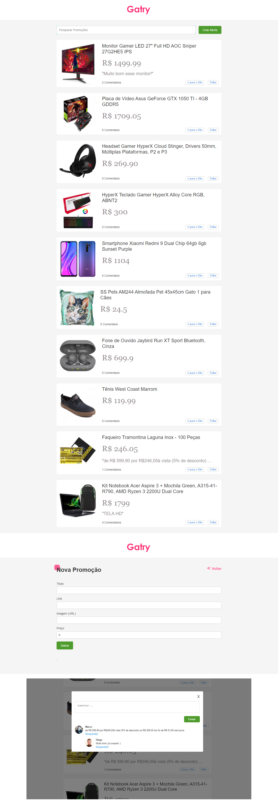

<p align="center">

</p>

<br/>

## ℹ️ Sobre o projeto

Projeto de um clone do site Gatry, baseado no curso do Vinicius Dacal.

## ✨ demonstração

</br>

</br>

## 🎯 Objetivo do projeto

O objetivo desse projeto foi praticar e melhorar minhas habilidades em React.

## 📝 Tecnologias

Para a realização desse projeto foi utilizado as seguintes tecnologias/linguagens:

- [ReactJS](https://pt-br.reactjs.org) para criação da interface
- [React-router-dom](https://www.npmjs.com/package/react-router-dom) para criação de rotas
- [Json-server](https://www.npmjs.com/package/json-server) para o back-end.

## ⚙️ Instalação

Para que este rode em sua máquina, siga os passos abaixo:

```bash
# Clone o repositório em alguma pasta em sua máquina
$ git clone https://github.com/Diegooliveyra/Gatry-Clone-React.git

# Entre no repositório
$ cd Gatry-Clone-React

Instale as dependencias digitando no termimal:
$ npm install

Rode a aplicação no modo de desenvolvimento.
$ npm start

Abra http://localhost:3000 no seu navegador para visualizar o projeto
```

## 📝 Licença

<p>O projeto se encontra sob licença MIT. Para mais detalhes, acesse <a href='LICENSE'>license<a>.</p>
<p>Criado com 💙 por <a href='https://github.com/Diegooliveyra/' target='blank'>Diego Oliveira</a></p>
